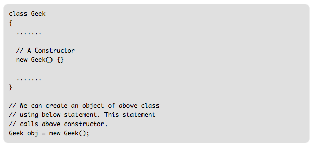
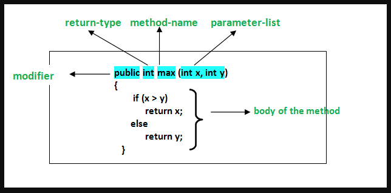

# Object-Constructors
* A [Constructor](https://www.geeksforgeeks.org/constructors-in-java/) is a function, used to initialize the object’s state. Like methods, a constructor also contains collection of statements.

* Each time an object is created using the new() keyword at least one Constructor is invoked to assign initial values to the data members of the same class.
 

* Methods allow us to reuse the code without retyping the code.
